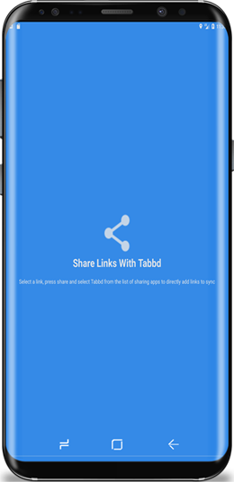
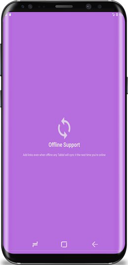

# Tabbd
### Sync links between your phone and PC with ease

## Introduction
Have you ever wanted to follow up on articles you read on your phone later? Perhaps a post on UX/UI which needs a bigger screen to read (your laptop)? Or have you ever been following up on a certain piece of news which you want to carry on reading on your phone perhaps coz you're gotta get going? Well, if you do fall in either (or both) category, Tabbd is for you. Tabbd is a bundled app comprising of an Android app and a Google Chrome extension. One click Facebook/Google registration lets you link the two and achieve complete control of your favorite links. No more keeping tabs open or looking up your history to find that link. Tabbd gets the job done with ease. The changes are real-time and the app is easy to use. 
Please go ahead and try it out and do rate it if you like it 😊

## What it does
Add links on Tabbd to open them immediately or later on your Google Chrome. Download the associated Tabbd Chrome extension on your PC to sync links between your mobile and PC in real time. Opt to open individual links or open all in separate tabs by clicking the 'Open All' button, the control is in your hand.

## How I built it
Android + Google Firebase + Google Chrome Extension

## Demo video
[Watch the demo](https://youtu.be/OSnnOfw9TIU)

## Download

[Android App](https://play.google.com/store/apps/details?id=com.akshaysadarangani.tabbd&hl=en)

[Google Chrome Extension](https://chrome.google.com/webstore/detail/tabbd/ihlgondhganfhackipognhhibiccgfpc?hl=en-US)

## Screenshots

## Bugs and Feedback
For bugs, questions and discussions please use the [Github Issues](https://github.com/aksh4y/Tabbd/issues).
